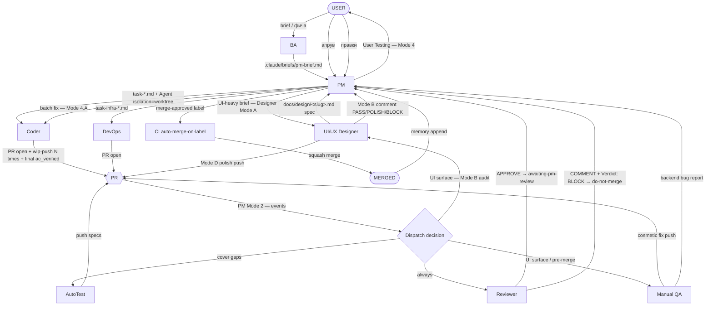
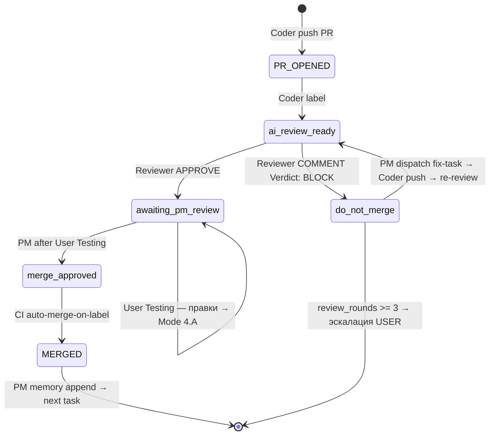

# contracts — Cross-Agent State Machine

Формализованный contract между агентами: кто кому когда отправляет state. Labels lifecycle, PR review flow, dispatch decisions.

**Кому читать:** PM (всегда), Coder/Reviewer/AutoTest (on-demand при cross-cutting situations).

---

## 1. High-level flow (Mermaid)



---

## 2. Labels lifecycle (single source of truth)

| Label                   | Кто ставит                                                              | Семантика                                                                                     | Кто снимает                                 |
| ----------------------- | ----------------------------------------------------------------------- | --------------------------------------------------------------------------------------------- | ------------------------------------------- |
| `ai-review-ready`       | Coder/DevOps после PR open                                              | PR готов к Review (исторически — auto-trigger archived `ai-review.yml`; сейчас informational) | Reviewer после APPROVE или manual           |
| `awaiting-pm-review`    | Reviewer (внутри APPROVE event)                                         | Reviewer APPROVE'нул, PM смотрит и идёт в User Testing                                        | PM при User Testing approve (Mode 2.B / 4)  |
| `do-not-merge`          | PM при `Verdict: BLOCK`                                                 | Critical issue найден, merge заблокирован                                                     | PM при следующем APPROVE Reviewer           |
| `merge-approved`        | PM после User Testing approve                                           | User-approve получен, CI делает squash-merge                                                  | (никто; auto-merge сам убирает после merge) |
| `ci-failed`             | CI / PM при `e2e_failed`                                                | E2E или CI step упал — нужен fix                                                              | PM после merge fix-task                     |
| `e2e-broken` (на issue) | CI (`notify_e2e` job)                                                   | E2E на main сломан — глобальный blocker, Coder не начинает новые задачи                       | CI auto-close при зелёном E2E на main       |
| `hook-bypass-warning`   | (зарезервирован для CI hook detection если `--no-verify` использовался) | Маркер что коммит обошёл pre-push hook                                                        | PM после расследования                      |

### 2.1. Label state machine (Mermaid)



---

## 3. Sequence diagrams

### 3.1. New feature (happy path)

```
USER → BA: "сделай Phase X"
BA → PM: .claude/briefs/pm-brief.md (commit + push)
PM → Coder: Agent(prompt="task-X.md", isolation="worktree", run_in_background=True)
  Coder → PR: wip-push milestone 1/N
  Coder → PR: wip-push milestone 2/N
  ...
  Coder → PR: final commit с `ac_verified: 1,2,3` + `vision: ✓ /X`
PM → Reviewer: Agent(prompt="PR #N")
  Reviewer → mcp__github__create_pull_request_review (APPROVE)
  Reviewer → label: awaiting-pm-review
PM (Mode 4) → bash scripts/pm/prep-user-testing.sh <branch> (run_in_background=True)
PM → USER: "PR #N готов к тестированию: https://<hash>.serveousercontent.com"
USER → PM: "апрув"
PM → label: merge-approved (CI auto-merge-on-label)
CI → squash-merge
PM → memory/coder/lessons.md (append 1-3 lessons)
PM → удалить отработанный task-файл (история в git)
PM → mcp__scheduled-tasks для следующего checkpoint если нужно
```

### 3.2. Review BLOCK path

```
PM → Reviewer: Agent(prompt="PR #N")
  Reviewer → mcp__github__create_pull_request_review (COMMENT)
            body starts with "Verdict: BLOCK"
PM → labels: -awaiting-pm-review, +do-not-merge
PM → review_rounds++ в pm-state.json
  IF review_rounds >= 3:
    STOP, эскалация USER ("PR #N не проходит review 3 раунда — нужен ручной разбор")
  ELSE:
    PM → создать task-fix-pr-N.md
    PM → Coder: Agent(prompt="task-fix-pr-N.md", target_branch=<pr-branch>)
      Coder → push fixes
    PM → Reviewer (повторно): Agent(prompt="PR #N")
      (loop until APPROVE OR review_rounds >= 3)
```

### 3.3. E2E fail path

```
CI → e2e.yml → fail
CI / PM → label: ci-failed
PM (Mode 2.C) → gh run view <run_id> --log-failed | tail -100
PM → классификация:
  - Баг в коде → Agent(Coder, task-fix-e2e-<slug>.md, target_branch=<pr-branch>)
  - Баг в тесте → Agent(AutoTest, task-fix-e2e-<slug>.md, target_branch=<pr-branch>)
  - Infra issue → Agent(DevOps, task-fix-e2e-<slug>.md)
после фикса → Reviewer → ... → как в 3.1 или 3.2
```

### 3.4. Compaction recovery

```
[SESSION ENDS / COMPACTION]
[NEW SESSION STARTS]

Любой агент:
  1. Read .claude/agents/<self>.md → Golden rules + Recovery checklist
  2. Read .claude/RULES.md → cross-agent rules
  3. Read .claude/agents/project-state.md → текущие фазы
  4. Read .claude/agents/memory/<self>/lessons.md

PM additional:
  5. Read .claude/state/pm-state.json (если есть)
  6. tail -5 .claude/coder-activity.log
  7. ls .claude/tasks/*.blocked.md
  8. ls .claude/tasks/*.progress.md (для крупных задач)
  9. Sync с remote: git fetch origin
 10. Resume on next_action (если есть и scheduled_at < now)

Coder additional:
  5. cat .claude/tasks/<my-task>.progress.md (если есть)
  6. tail -3 .claude/coder-activity.log | grep INTENT
  7. git status / git log --oneline -5 / pwd
  8. Resume on milestone N+1 если sentinel говорит N done
```

---

## 4. Task file → agent mapping

| Task pattern              | Agent              | Triggered by                                                |
| ------------------------- | ------------------ | ----------------------------------------------------------- |
| `task-<slug>.md`          | Coder              | PM Mode 1 (new feature decomposition)                       |
| `task-design-<slug>.md`   | UI/UX Designer     | PM Mode 1 (UI-heavy фича — Mode A direction)                |
| `task-fix-pr-<N>.md`      | Coder              | PM Mode 2.D (after BLOCK) или Mode 4.A (User Testing fixes) |
| `task-fix-e2e-<slug>.md`  | AutoTest или Coder | PM Mode 2.C (e2e_failed)                                    |
| `task-fix-test-<slug>.md` | AutoTest           | PM при обнаружении gap в coverage                           |
| `task-infra-<slug>.md`    | DevOps             | PM из BA brief или из incident                              |
| `task-<X>.blocked.md`     | (agent X)          | Agent X создал, PM читает                                   |
| `task-<X>.progress.md`    | Coder              | Coder sentinel для крупных задач (>4 файлов)                |

---

## 5. AutoTest dispatch decision (PM Mode 2)

После того как Coder создал/обновил PR — PM проверяет diff на E2E coverage **ДО** диспетча AutoTest:

```bash
# Сколько spec.ts файлов в diff PR
gh api repos/yaremenko-maksym/CheekyCheeseIT_CRM/pulls/<N>/files \
  --jq '[.[] | select(.filename | test("apps/e2e/tests/.*\\.spec\\.ts$"))] | length'
```

| Состояние                                                              | Действие                                        | Event в pm-state.json                                        |
| ---------------------------------------------------------------------- | ----------------------------------------------- | ------------------------------------------------------------ |
| Coder НЕ добавил spec'ы И PR трогает `apps/web/**` или `apps/api/**`   | **MUST dispatch AutoTest**                      | `agent_started` (autotest)                                   |
| Coder добавил spec'ы, но названия тестов НЕ покрывают AC из task-файла | **MUST dispatch AutoTest** в Режиме «дополнить» | `agent_started` (autotest, mode=cover-gaps)                  |
| Coder добавил spec'ы, названия тестов покрывают AC                     | **Skip AutoTest**                               | `autotest_skipped` с `reason: "coder-added-e2e-covering-ac"` |
| PR трогает только docs/business/\*\* или CI                            | **Skip AutoTest**                               | `autotest_skipped` с `reason: "no-product-code-changes"`     |

**Skip без записи запрещён.** Skip-решение всегда фиксируется в `events[]`.

---

## 5.1. Manual QA dispatch decision (PM Mode 2 / Mode 4)

Manual QA — это интерактивный субагент, который проходит фичу на ЖИВОМ стеке через Playwright MCP. Дополняет AutoTest (тот пишет `.spec.ts` с mocked данными), Manual QA ловит то, что mocked E2E пропускает: визуальные дефекты, broken/empty states, кириллицу в PDF/CSV, реальное RBAC поведение, console-ошибки.

**Когда дispatch'ить:**

| Состояние                                                                                | Действие                              | Event в pm-state.json                                |
| ---------------------------------------------------------------------------------------- | ------------------------------------- | ---------------------------------------------------- |
| PR трогает `apps/web/**` И добавляет новую визуальную фичу / экран / поток               | **MUST dispatch Manual QA** до merge  | `agent_started` (manual-qa, mode=pr-final-visual)    |
| PR содержит download / export (PDF / CSV / file) для проверки кириллицы / layout         | **MUST dispatch Manual QA**           | `agent_started` (manual-qa, mode=download-verify)    |
| PR трогает RBAC-gated роуты или меняет видимость по ролям                                | **MUST dispatch Manual QA**           | `agent_started` (manual-qa, mode=rbac-verify)        |
| PR только backend / refactor / `apps/api/**` без UI surface                              | **Skip Manual QA**                    | `manualqa_skipped` с `reason: "no-ui-surface"`       |
| PR только docs / CI / `.github/**` / migrations без UI                                   | **Skip Manual QA**                    | `manualqa_skipped` с `reason: "no-ui-surface"`       |
| AutoTest добавил `.spec.ts` покрывающий golden path, НО фича визуально новая / сложная   | **MUST dispatch Manual QA дополнительно** (mocked E2E ≠ visual UT) | `agent_started` (manual-qa, mode=complement-e2e) |

**Параллельность:** Manual QA диспатчится **параллельно** с code-reviewer (`run_in_background=True`). Reviewer делает статический анализ кода; Manual QA — динамический visual / functional проход. Не дублируют друг друга.

**Skip без записи запрещён** — как и для AutoTest.

**Финал:** Manual QA пишет отчёт PM (severity-табличка + скриншоты в `/tmp/manual-qa-<runid>/`). Cosmetic UI bugs Manual QA фиксит сам в `apps/web/**` и пушит. Backend / функциональные баги → PM решает: `task-fix-pr-N.md` для Coder.

См. `manual-qa.md` для полного workflow + zone-of-write.

---

## 5.2. UI/UX Designer dispatch decision (PM Mode 1 + Mode 2)

Designer работает в 4 режимах. Когда дispatch'ить:

### Mode A — Design Direction (pre-feature, PM Mode 1)

| Trigger                                                                                    | Действие                                  | Event в pm-state.json                          |
| ------------------------------------------------------------------------------------------ | ----------------------------------------- | ---------------------------------------------- |
| BA brief описывает новый экран / поток / dashboard / UI-heavy фичу (не table CRUD)         | **MUST dispatch Designer Mode A** ДО Coder | `agent_started` (ui-ux-designer, mode=design-direction) |
| BA brief — backend-only / API-only / migration / CI                                        | **Skip Designer Mode A**                   | `designer_skipped` с `reason: "no-ui-surface"` |
| BA brief — minor UI tweak (текст / цвет / inline edit без нового layout)                   | **Skip Designer Mode A**                   | `designer_skipped` с `reason: "minor-tweak"`   |

Designer Mode A output → `docs/design/<slug>.md` spec → PM передаёт ссылку в task-файл Coder'у.

### Mode B / C — Visual Audit + AI-slop check (post-impl, PM Mode 2 — параллельно с code-reviewer)

| Trigger                                                                                  | Действие                                              |
| ---------------------------------------------------------------------------------------- | ----------------------------------------------------- |
| PR трогает `apps/web/**` (новый экран / новые компоненты / styling changes)             | **MUST dispatch Designer Mode B** (включает Mode C)   |
| PR только `apps/web/app/components/ui/<existing>.tsx` с minor classNames / token rename | **Optional** — PM решает по PR description           |
| PR только backend / refactor / migrations / CI                                          | **Skip Designer**                                     |

Параллельно с code-reviewer / security-reviewer / Manual QA — все 4 в одном dispatch message, `run_in_background=True`.

Designer Mode B даёт event `designer_review_done` с verdict:

- `PASS` (avg score ≥ 8/10, нет HIGH) → переход к `awaiting-pm-review`.
- `POLISH-REQUESTED` (avg 6-8/10, LOW/MED suggestions) → merge allowed, PM создаёт follow-up task (не блокирует).
- `BLOCK` (avg <6/10 ИЛИ generic AI pattern ИЛИ WCAG fail на critical path) → `do-not-merge` label, `task-fix-pr-N.md` для Coder.

### Mode D — Polish pass (PM Mode 2 или 4)

Trigger: code-reviewer / Manual QA / Designer Mode B пометили LOW-severity cosmetic issue → Designer Mode D Edit'ит сам в `apps/web/**` cosmetic + re-verify скриншотом + push в ту же ветку.

**Aggregate verdict logic (Mode 2):** PM объединяет 4 verdict'a (code-reviewer + security-reviewer если триггернут + Manual QA + Designer Mode B) → если ВСЕ PASS → `awaiting-pm-review`. Если хотя бы один BLOCK → `do-not-merge`.

См. `ui-ux-designer.md` для полного workflow + zone-of-write.

---

## 5.3. Flaky E2E SLA (PM Mode 2)

Политика zero-flaky: любой флак чинится немедленно, не маскируется и не «пересиживается» через re-run.

**Сигналы флака:**

- CI показывает тесты со статусом `flaky` (прошли с retry) — flaky-report в summary;
- E2E job прошёл только после ручного re-run;
- агент/USER наблюдал нестабильность локально.

**SLA — в тот же день (до следующего `merge-approved`):**

1. PM записывает `flaky_detected` event в pm-state.json: `{spec, test, run_url}`.
2. PM dispatch `autotest` **Режим 4 Fix-Flaky** (промпт: `<spec>:<test>` + ссылки на runs).
3. До диспетча флак НЕ «прощается»: re-run для разблокировки merge допустим, но ТОЛЬКО вместе с записью `flaky_detected` + dispatch — иначе это маскировка.

**Definition of fixed:** найден root cause (НЕ повышение таймаутов, НЕ retry-маскировка), тест 10/10 зелёный локально в изоляции + полный шард 1×. Известный класс причин: dev/prod build difference — CI гоняет production build, где dev-only элементы tree-shaken (см. `memory/autotest/lessons.md`).

---

## 6. Reviewer verdict semantics

| Event API         | Body first line  | Семантика                       | PM action                                            |
| ----------------- | ---------------- | ------------------------------- | ---------------------------------------------------- |
| `APPROVE`         | (любой)          | OK, PR можно мерджить           | label `awaiting-pm-review`, далее Mode 4             |
| `COMMENT`         | `Verdict: BLOCK` | Critical issues, merge запрещён | label `-awaiting-pm-review, +do-not-merge`, fix-task |
| `COMMENT`         | (другое)         | Информационный комментарий      | Optional read, no state change                       |
| `REQUEST_CHANGES` | (любой)          | От внешнего reviewer (не AI)    | `review_rounds++`, fix-task                          |

**Почему AI-агенты не используют `REQUEST_CHANGES`:** GitHub API запрещает `REQUEST_CHANGES` когда author == reviewer (один owner-аккаунт `yaremenko-maksym`). Используется `COMMENT` + `Verdict: BLOCK` в первой строке тела.

---

## 7. Coder watchdog — recovery layers

См. `coder.md` секция 8.

| Layer | Тип                                                     | Где данные                             | Purpose                                    |
| ----- | ------------------------------------------------------- | -------------------------------------- | ------------------------------------------ |
| 8.1   | Auto-hook (PostToolUse Edit/Write)                      | `.claude/coder-activity.log`           | «Живой ли Coder» — last activity timestamp |
| 8.1.1 | Opt-in intent markers (`scripts/coder/coder-intent.sh`) | Тот же лог, type `INTENT`              | «Что Coder намеревался» — semantic context |
| 8.2   | Semantic milestones (`<task>.progress.md`)              | Файл в `.claude/tasks/` (committed) | «Какой milestone reached»                  |

**PM при detection hung** (см. `pm-snippets.md` секция «Coder hung — recovery»):

1. `awk -F'\t' '$2=="INTENT"' .claude/coder-activity.log | tail -5` — last intents
2. `awk -F'\t' '$2!="INTENT"' .claude/coder-activity.log | tail -10` — last edits
3. Из последней строки извлечь `<cwd>` → `git -C <cwd> log/status` для recovery
4. Если `<task>.progress.md` есть — читать `current_milestone` для resume point

---

## 8. Out-of-band escalation

| Ситуация                                       | Кто инициирует                                     | Куда                                                              |
| ---------------------------------------------- | -------------------------------------------------- | ----------------------------------------------------------------- |
| Coder обнаружил неописанную бизнес-логику      | Coder создаёт `.claude/tasks/<task>.blocked.md` | PM читает на next wakeup → задаёт USER                            |
| Reviewer найден `Verdict: BLOCK` 3 раза подряд | PM (circuit breaker `review_rounds >= 3`)          | USER напрямую                                                     |
| E2E sustained failure после 2 fix-attempt      | PM                                                 | USER напрямую                                                     |
| Workflow file edit нужен                       | Coder/AutoTest → `.blocked.md`                     | PM → DevOps task                                                  |
| Security issue в чужом code (high confidence)  | Любой агент                                        | `mcp__ccd_session__spawn_task` (если применимо) или `.blocked.md` |

---

## 9. Where to update this file

- Когда меняется label semantics → §2 + §2.1
- Когда добавляется новый task pattern → §4
- Когда меняется dispatch decision matrix → §5
- Когда меняется Reviewer event semantics → §6
- Когда обновляется recovery protocol → §7 (но детали — в `coder.md` секция 8)
