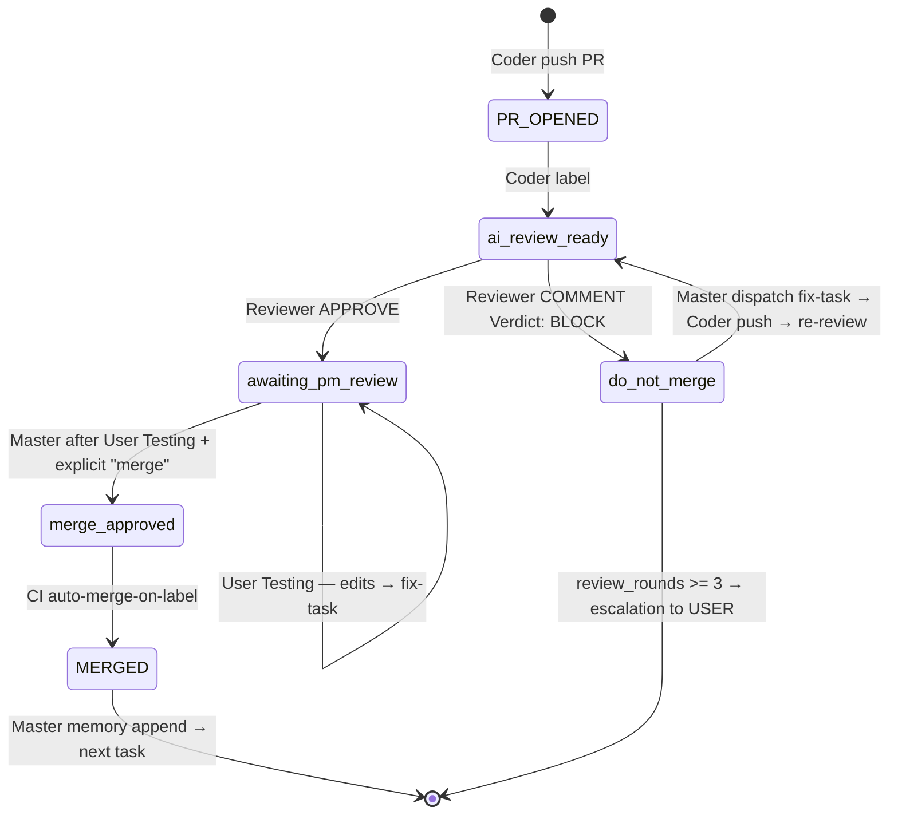

# contracts — Master-direct-dispatch contracts

A formalized contract between agents: who sends state to whom and when. Master
(the USER session) directly dispatches agents via the `Agent` tool and performs the role of
the orchestrator — decomposition, launch, monitoring, the aggregate verdict, label gating,
User Testing. There is no separate PM agent (removed 2026-10-05: a sub-agent technically could not
spawn agents, and the "full pipeline" with the BA and PM roles via task files and User Testing was never executed once).

**Who should read:** Master (on a cross-cutting dispatch), Coder/Reviewer/AutoTest/Designer/
Manual-QA (on-demand, when you need to understand the verdict semantics or recovery).

This file holds what does not belong to a single agent: the labels lifecycle, the dispatch triggers
for the remaining agents, the verdict semantics, the flaky-E2E SLA, the Coder recovery layers.

---

## 1. Labels lifecycle (single source of truth)

| Label                   | Who sets it                                                             | Semantics                                                                                     | Who removes it                              |
| ----------------------- | ----------------------------------------------------------------------- | --------------------------------------------------------------------------------------------- | ------------------------------------------- |
| `ai-review-ready`       | Coder/DevOps after a PR open                                            | The PR is ready for Review (historically — an auto-trigger of the archived `ai-review.yml`; now informational) | Reviewer after APPROVE or manual            |
| `awaiting-pm-review`    | Reviewer (inside the APPROVE event)                                     | The Reviewer APPROVEd, Master looks and goes into User Testing                                | Master on User Testing approve              |
| `do-not-merge`          | Master on `Verdict: BLOCK`                                              | A critical issue found, merge blocked                                                         | Master on the next Reviewer APPROVE         |
| `merge-approved`        | **ONLY Master/owner** after an explicit "merge" from the owner          | User-approve received, CI does the squash-merge                                               | (no one; auto-merge removes it after merge) |
| `ci-failed`             | CI / Master on `e2e_failed`                                             | An E2E or CI step failed — a fix is needed                                                    | Master after merging the fix-task           |
| `e2e-broken` (on an issue) | CI (the `notify_e2e` job)                                            | E2E on main is broken — a global blocker, Coder does not start new tasks                      | CI auto-close when E2E on main is green      |
| `hook-bypass-warning`   | (reserved for CI hook detection if `--no-verify` was used)              | A marker that the commit bypassed the pre-push hook                                           | Master after an investigation               |

> **Invariant (golden rule, did NOT belong to PM):** `merge-approved` is set **only** by
> Master/owner and **only** after an explicit "merge" from the owner in the chat. No agent
> (including the reviewers) touches it. Incident 2026-06-21 (#270): a reviewer agent
> arbitrarily added the label → the PR merged before the review finished. See
> `.claude/rules/common/design-gate.md` + the memory `feedback_reviewer_self_merge_incident`.

### 1.1. Label state machine (Mermaid)


```mermaid
stateDiagram-v2
    [*] --> PR_OPENED: Coder push PR
    PR_OPENED --> ai_review_ready: Coder label
    ai_review_ready --> awaiting_pm_review: Reviewer APPROVE
    ai_review_ready --> do_not_merge: Reviewer COMMENT Verdict: BLOCK
    do_not_merge --> ai_review_ready: Master dispatch fix-task → Coder push → re-review
    awaiting_pm_review --> merge_approved: Master after User Testing + explicit "merge"
    awaiting_pm_review --> awaiting_pm_review: User Testing — edits → fix-task
    merge_approved --> MERGED: CI auto-merge-on-label
    MERGED --> [*]: Master memory append → next task
    do_not_merge --> [*]: review_rounds >= 3 → escalation to USER
```

---

## 2. Task file → agent mapping

The task files (`.claude/tasks/`) are owned by Master. He creates them during decomposition and passes
the path to the agent in the dispatch prompt.

| Task pattern              | Agent              | Triggered by                                          |
| ------------------------- | ------------------ | ----------------------------------------------------- |
| `task-<slug>.md`          | Coder              | Master (decomposition of a new feature)               |
| `task-design-<slug>.md`   | UI/UX Designer     | Master (a UI-heavy feature — Mode A direction)        |
| `task-fix-pr-<N>.md`      | Coder              | Master after a BLOCK or after User Testing edits      |
| `task-fix-e2e-<slug>.md`  | AutoTest or Coder  | Master on `e2e_failed`                                |
| `task-fix-test-<slug>.md` | AutoTest           | Master on discovering a gap in coverage               |
| `task-infra-<slug>.md`    | DevOps             | Master from an incident / infra need                  |
| `task-<X>.blocked.md`     | (agent X)          | Agent X created it, Master reads it                   |
| `task-<X>.progress.md`    | Coder              | The Coder sentinel for large tasks (>4 files)         |

---

## 2.1. Critical-path trigger zones (cost-of-error gate)

If the task/PR touches any of the zones below — **the full track + a MANDATORY `security-reviewer`**
in parallel with `code-reviewer`. This axis (cost-of-error) runs **first** and beats everything
below: neither light-track nor the autonomy axis weakens it (a decision in these zones cannot be A1 —
see `autonomy-levels.md`).

- auth / sessions / JWT / OAuth
- finance / calculation logic / split math / rates
- RBAC / role visibility / data masking
- wallets / transactions / company-account (USDT)
- Drizzle migrations / new tables

This table is the canonical source (moved here 2026-10-05 from the removed `pm.md`).
The "critical-path trigger zones" references from `orchestration-routing.md`, `autonomy-levels.md`,
`model-routing.md` point here.

---

## 3. AutoTest dispatch decision

After the Coder created/updated a PR — Master checks the diff for E2E coverage **BEFORE**
dispatching AutoTest:

```bash
# How many spec.ts files are in the PR diff
gh api repos/yaremenko-maksym/CheekyCheeseIT_CRM/pulls/<N>/files \
  --jq '[.[] | select(.filename | test("apps/e2e/tests/.*\\.spec\\.ts$"))] | length'
```

| State                                                                  | Action                                          |
| ---------------------------------------------------------------------- | ----------------------------------------------- |
| The Coder did NOT add specs AND the PR touches `apps/web/**` or `apps/api/**` | **MUST dispatch AutoTest**                |
| The Coder added specs, but the test names do NOT cover the AC from the task file | **MUST dispatch AutoTest** in the "supplement" mode |
| The Coder added specs, the test names cover the AC                     | **Skip AutoTest** (reason: coder-added-e2e)     |
| The PR touches only docs/business/\*\* or CI                           | **Skip AutoTest** (reason: no-product-code)     |

**A skip is recorded as a decision** — in the PR body / task file note the skip reason (as an A1 decision
per `autonomy-levels.md`). A silent skip is forbidden.

---

## 3.1. Manual QA dispatch decision

Manual QA — an interactive sub-agent, walks a feature on the LIVE stack via Playwright MCP.
Complements AutoTest (that one writes `.spec.ts` with mocked data), Manual QA catches what mocked
E2E misses: visual defects, broken/empty states, Cyrillic in PDF/CSV, real RBAC
behavior, console errors.

**When to dispatch:**

| State                                                                                    | Action                                                            |
| ---------------------------------------------------------------------------------------- | ----------------------------------------------------------------- |
| The PR touches `apps/web/**` AND adds a new visual feature / screen / flow               | **MUST dispatch Manual QA** before merge                          |
| The PR contains a download / export (PDF / CSV / file) to check Cyrillic / layout        | **MUST dispatch Manual QA**                                       |
| The PR touches RBAC-gated routes or changes role visibility                              | **MUST dispatch Manual QA**                                       |
| The PR is only backend / refactor / `apps/api/**` without a UI surface                   | **Skip Manual QA** (reason: no-ui-surface)                        |
| The PR is only docs / CI / `.github/**` / migrations without UI                          | **Skip Manual QA** (reason: no-ui-surface)                        |
| AutoTest added a `.spec.ts` covering the golden path, BUT the feature is visually new / complex | **MUST additionally dispatch Manual QA** (mocked E2E ≠ visual UT) |

**Parallelism:** Manual QA is dispatched **in parallel** with code-reviewer (`run_in_background=True`).
The Reviewer does static analysis of the code; Manual QA — a dynamic visual / functional pass.

**Finale:** Manual QA writes a report to Master (a severity table + screenshots). Cosmetic UI bugs
Manual QA fixes itself in `apps/web/**` and pushes. Backend / functional bugs → Master decides:
`task-fix-pr-N.md` for Coder.

See `manual-qa.md` for the full workflow + zone-of-write.

---

## 3.2. UI/UX Designer dispatch decision

The Designer works in modes A/B/C/D/E (see `ui-ux-designer.md`). When to dispatch:

### Mode A — Design Direction (pre-feature)

| Trigger                                                                                    | Action                                        |
| ------------------------------------------------------------------------------------------ | --------------------------------------------- |
| The task describes a new screen / flow / dashboard / a UI-heavy feature (not a table CRUD) | **MUST dispatch Designer Mode A** BEFORE Coder |
| Backend-only / API-only / migration / CI                                                   | **Skip Designer Mode A** (reason: no-ui)      |
| A minor UI tweak (text / color / inline edit without a new layout)                         | **Skip Designer Mode A** (reason: minor-tweak)|

The Designer Mode A / E output → `docs/design/<slug>.md` spec → Master passes the link into the Coder's task file.

### Mode B / C — Visual Audit + fidelity + AI-slop check (post-impl, in parallel with code-reviewer)

| Trigger                                                                                  | Action                                              |
| ---------------------------------------------------------------------------------------- | --------------------------------------------------- |
| The PR touches `apps/web/**` (a new screen / new components / styling changes)           | **MUST dispatch Designer Mode B** (includes Mode C) |
| The PR is only `apps/web/app/components/ui/<existing>.tsx` with minor classNames / a token rename | **Optional** — Master decides by the PR description |
| The PR is only backend / refactor / migrations / CI                                      | **Skip Designer**                                   |

The Designer Mode B verdict (`Design Review:` + `Fidelity:`):

- `PASS` → transition to `awaiting-pm-review`.
- `POLISH-REQUESTED` / `ISSUES` → by strictness = BLOCK before merge (a fix-task).
- `BLOCK` → the `do-not-merge` label, `task-fix-pr-N.md` for Coder.

### Mode D — Polish pass

Trigger: code-reviewer / Manual QA / Designer Mode B flagged a LOW-severity cosmetic issue →
Designer Mode D Edits the cosmetic itself in `apps/web/**` + re-verify with a screenshot + push.

**Aggregate verdict logic:** Master combines the verdicts (code-reviewer + security-reviewer
if triggered + spec-reviewer + Manual QA + Designer Mode B + copy-reviewer on text) →
if ALL PASS → `awaiting-pm-review`. Any BLOCK → `do-not-merge`.

See `ui-ux-designer.md` for the full workflow + zone-of-write.

---

## 3.3. Flaky E2E SLA

The zero-flaky policy: any flake is fixed immediately, not masked and not "waited out"
via a re-run.

**Signs of a flake:**

- CI shows tests with the `flaky` status (passed with a retry) — a flaky-report in the summary;
- the E2E job passed only after a manual re-run;
- an agent/USER observed instability locally.

**SLA — the same day (before the next `merge-approved`):**

1. Master records `flaky_detected` (spec / test / run_url) in the task file / notes.
2. Master dispatches `autotest` in the **Fix-Flaky Mode** (prompt: `<spec>:<test>` + links to the runs).
3. Until the dispatch the flake is NOT "forgiven": a re-run to unblock the merge is allowed, but ONLY
   together with the record + dispatch — otherwise it is masking.

**Definition of fixed:** a root cause found (NOT raising the timeouts, NOT retry-masking),
the test 10/10 green locally in isolation + the full shard 1×. A known class of causes: a dev/prod
build difference — CI runs the production build, where dev-only elements are tree-shaken (see
`memory/autotest/lessons.md`).

---

## 3.4. spec-reviewer dispatch decision

The second review axis: conformance of the diff to the **task**. Complements `code-reviewer` (code
correctness) and `security-reviewer` (security). Neither of them answers the question "was
what was asked done, and only that" — before the axis existed, the only carrier of this fact was
the trailer `ac_verified:`, which the coder writes about himself.

| State                                                                                | Action                                                             |
| ------------------------------------------------------------------------------------ | ------------------------------------------------------------------ |
| The PR has an original task (`task-<slug>.md` or an issue via `Closes #N`)           | **MUST dispatch spec-reviewer**                                    |
| A fix-PR for review findings (`task-fix-pr-<N>.md`)                                  | **MUST dispatch** — the task is the fix-task with the identifiers  |
| There is no task in any form (an ad-hoc edit, a hotfix per verbal instruction)       | **Skip** (reason: no-source-spec)                                  |
| A docs-only diff without AC                                                           | **Skip** (reason: docs-only)                                       |

**Parallelism:** dispatched in the same message as `code-reviewer` (+ `security-reviewer`
on the critical-path, + `manual-qa` / `ui-ux-designer` on UI), all with `run_in_background=True`.

**Verdict:** `Spec Review: PASS | ISSUES | BLOCK`, findings with the `SPEC-` prefix, the control
line `Findings: … (N)`. `ISSUES` by strictness is equated to BLOCK before merge.

See `spec-reviewer.md` for the full workflow.

---

## 4. Reviewer verdict semantics

| Event API         | Body first line                 | Semantics                             | Master action                                                           |
| ----------------- | ------------------------------- | ------------------------------------- | ----------------------------------------------------------------------- |
| `APPROVE`         | (any)                           | OK, the PR can be merged              | label `awaiting-pm-review`, then User Testing                           |
| `COMMENT`         | `Verdict: BLOCK`                | Critical issues, merge forbidden      | label `-awaiting-pm-review, +do-not-merge`, a fix-task                  |
| `COMMENT`         | (other)                         | An informational comment              | Optional read, no state change                                          |
| `REQUEST_CHANGES` | (any)                           | From an external reviewer (not AI)    | `review_rounds++`, a fix-task                                           |
| `COMMENT`         | `Spec Review: BLOCK` / `ISSUES` | The diff diverged from the task       | label `-awaiting-pm-review, +do-not-merge`, a fix-task with `SPEC-` findings |
| `COMMENT`         | `Spec Review: N/A`              | The task was not found — a question to the task-setting | Master decides: create a task or record a skip        |

**Why AI agents do not use `REQUEST_CHANGES` / `APPROVE`:** the GitHub API forbids both,
when author == reviewer (one owner account `yaremenko-maksym`) — `APPROVE` returns 422
`"Can not approve your own pull request"`. `COMMENT` + `Verdict:` on the first line
of the body is used, Master parses the first line. Verified on PR #536 (2026-08-17).

---

## 5. Coder watchdog — recovery layers

See `coder.md` section 8.

| Layer | Type                                                    | Where the data is                      | Purpose                                    |
| ----- | ------------------------------------------------------- | -------------------------------------- | ------------------------------------------ |
| 8.1   | Auto-hook (PostToolUse Edit/Write)                      | `.claude/coder-activity.log`           | "Is the Coder alive" — last activity timestamp |
| 8.1.1 | Opt-in intent markers (`scripts/coder/coder-intent.sh`) | The same log, type `INTENT`            | "What the Coder intended" — semantic context |
| 8.2   | Semantic milestones (`<task>.progress.md`)              | A file in `.claude/tasks/` (committed) | "Which milestone is reached"               |

**Master on detecting a hang:**

1. `awk -F'\t' '$2=="INTENT"' .claude/coder-activity.log | tail -5` — the last intents
2. `awk -F'\t' '$2!="INTENT"' .claude/coder-activity.log | tail -10` — the last edits
3. From the last line extract `<cwd>` → `git -C <cwd> log/status` for recovery
4. If `<task>.progress.md` exists — read `current_milestone` for the resume point

---

## 6. Out-of-band escalation

| Situation                                      | Who initiates                                      | Where                                  |
| ---------------------------------------------- | -------------------------------------------------- | -------------------------------------- |
| The Coder discovered undescribed business logic | The Coder creates `.claude/tasks/<task>.blocked.md` | Master reads → decides / asks the USER |
| The Reviewer found `Verdict: BLOCK` 3 times in a row | Master (circuit breaker `review_rounds >= 3`)  | USER directly                          |
| E2E sustained failure after 2 fix-attempts     | Master                                             | USER directly                          |
| A workflow file edit is needed                 | Coder/AutoTest → `.blocked.md`                     | Master → a DevOps task                 |

---

## 7. Compaction recovery

```
[SESSION ENDS / COMPACTION]
[NEW SESSION STARTS]

Any agent:
  1. Read .claude/agents/<self>.md → Golden rules + Recovery checklist
  2. Read .claude/RULES.md → cross-agent rules
  3. Read .claude/agents/project-state.md → the current phases
  4. Read .claude/agents/memory/<self>/lessons.md

Coder additional:
  5. cat .claude/tasks/<my-task>.progress.md (if any)
  6. tail -3 .claude/coder-activity.log | grep INTENT
  7. git status / git log --oneline -5 / pwd
  8. Resume on milestone N+1 if the sentinel says N done
```

---

## 8. Where to update this file

- When the label semantics change → §1
- When a new task pattern is added → §2
- When the dispatch decision matrix changes → §3 / §3.1–§3.4
- When the Reviewer event semantics change → §4
- When the recovery protocol is updated → §5 (details — in `coder.md` section 8)
